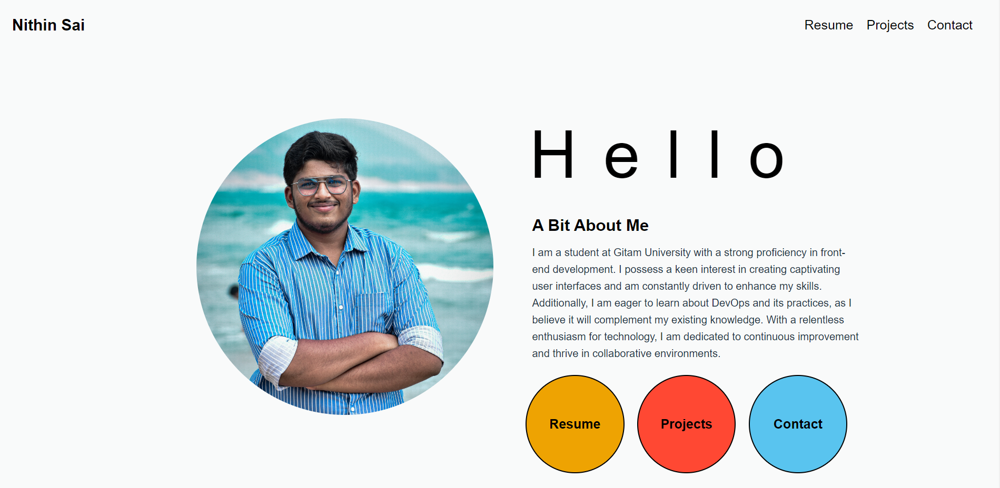

# Oasis-task2-portfolio

# Portfolio

This is a portfolio website showcasing my projects and contact information. The website is designed to be responsive, providing an optimal viewing experience on both desktop and mobile devices.

## Features

- Home page introducing the portfolio
- Resume page displaying my resume or CV
- Projects page showcasing my projects
- Contact page with contact information

## Technologies Used

- HTML5
- CSS3

## Screenshots

*Home Page* link https://nithinsaichoudary.github.io/Oasis-task2-portfolio/

## Getting Started

To view the website locally, follow these steps:

1. Clone the repository:

  shell
   git clone https://github.com/your-username/portfolio.git
 

2. Navigate to the project directory:

shell
   cd portfolio

3. Open the `index.html` file in your preferred web browser.

## Folder Structure

The repository is structured as follows:

- `index.html`: Home page HTML file
- `resume.html`: Resume page HTML file
- `projects.html`: Projects page HTML file
- `css/`: Folder containing CSS stylesheets
  - `style.css`: Main CSS file for styling the website
- `img/`: Folder containing image assets
  - `location-icon.png`: Location icon image
  - `email-icon.png`: Email icon image
  - `phone-icon.png`: Phone icon image
- `screenshots/`: Folder containing screenshots
  - `home.png`: Screenshot of the home page
  - `resume.png`: Screenshot of the resume page
  - `projects.png`: Screenshot of the projects page
  - `contact.png`: Screenshot of the contact page

## Contributing

Contributions are welcome! If you find any issues or have suggestions for improvements, please feel free to open an issue or submit a pull request.

